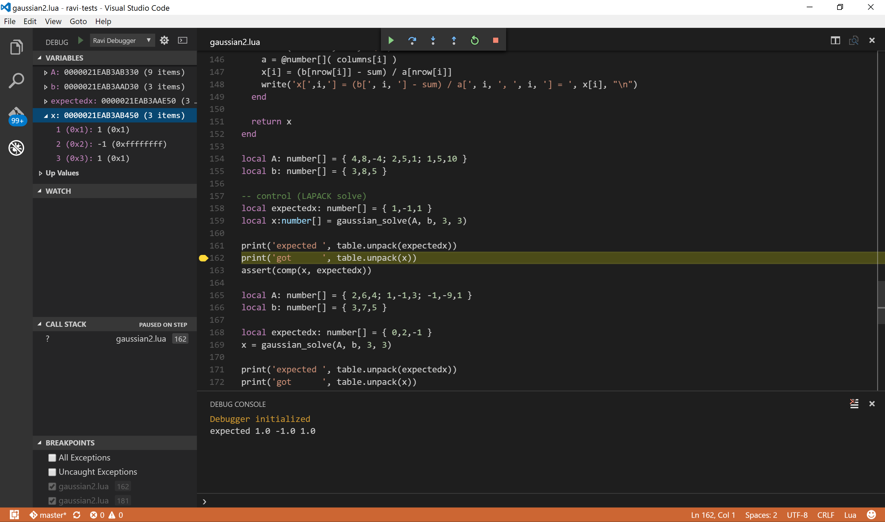
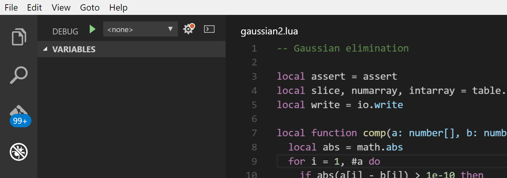
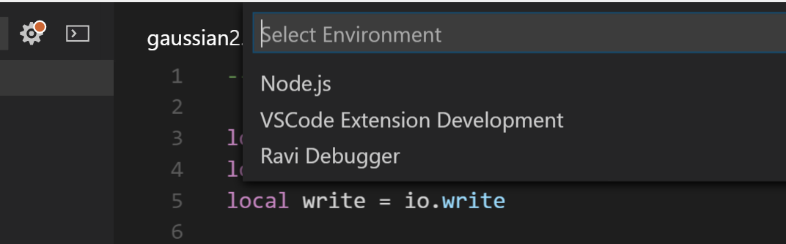
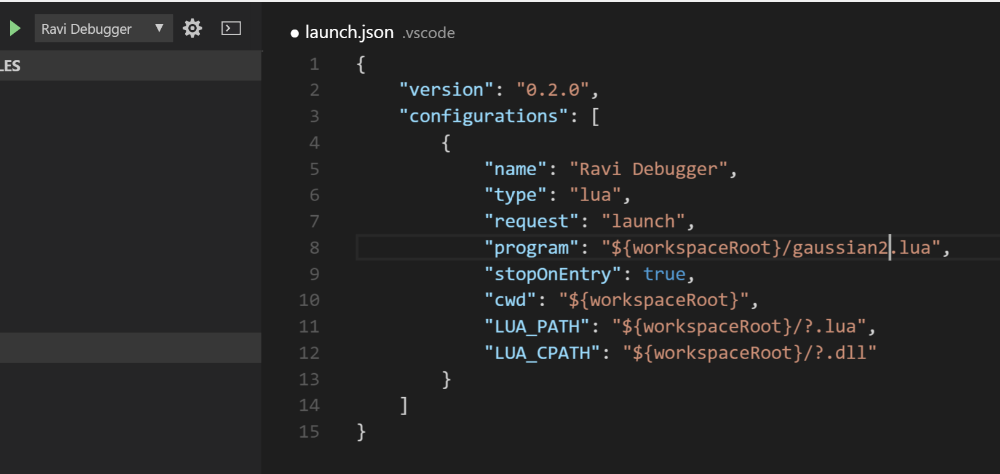

Lua and Ravi 5.3 Debug Adapter for VSCode
=========================================

This project aims to provide a debug adapter that allows Microsoft's Visual Studio Code to step through [Ravi](http://ravilang.org) or [Lua 5.3](http://www.lua.org) code.

Status
------
This is work in progress. The basic debugger is working with following features and limitations.

* Launch a Ravi/Lua 5.3 script and stop on entry 
* Step through code
* Set breakpoints at line/source level (upto a max of 20 breakpoints)
* Local variables and variable arguments are shown in the Variables window; number of variables displayed is limited to 120
* Tables are expanded to one level only - expansion limited to 120 elements
* Lua stdout and stderr are redirected to the debugger
* The debugger can step into dynamically generated Lua code
* Has been tested briefly on Windows 10, Ubuntu and OSX so far
* Various limitations - see list below

Note: This is very early days so please expect bugs!

Installation
------------
You can install the Ravi Debug extension from VSCode Marketplace - search for 'Lua and Ravi 5.3 Debugger'. Pre-built 64-bit binaries for Windows 10, OS X El Capitan, and Ubuntu 16.04 are included in the installation - note that these do not have JIT enabled.

Issues and Limitations
----------------------
* The 'pause' function does not work, i.e. you cannot pause a running script
* Globals variables cannot be expanded as yet
* In all cases the number of variables or table entries displayed is truncated to 120 items
* The stack trace is truncated to 50 items
* Only upto 20 breakpoints can be set
* You cannot set a breakpoint against a dynamically generated Lua function 
* You may not be able to debug Lua 5.0, 5.1 or 5.2 scripts - only 5.3 is tested and officially supported
* Table variables can only be expanded to 1 level (global tables cannot be expanded yet)
* You cannot attach to a script already running somewhere
* When the debugger runs the Lua Hook is disabled - so the running script is not allowed to modify the hook
* The type and value display does not yet recognise Ravi types or Lua number subtypes
* Evaluating expressions is not supported
* You cannot modify the variables displayed - the values are readonly
* If you amend/edit the script being debugged it will not be recognised in the debug session so you will need to start a new session to recognise changes
* Using LUA_PATH and LUA_CPATH has been tested briefly

Getting Started
---------------
Once you have installed the extension, you will need to setup launch.json as shown in the steps below.

See also
--------
[Ravi Programming Language](http://ravilang.org)

Implementation Notes
--------------------
The debugger is a standalone executable that can be invoked by VSCode. VSCode communicates 
with the debugger via stdin/stdout as per the VSCode debug adapter API which uses 
JSON messages exchanged between VSCode and the debugger. 
